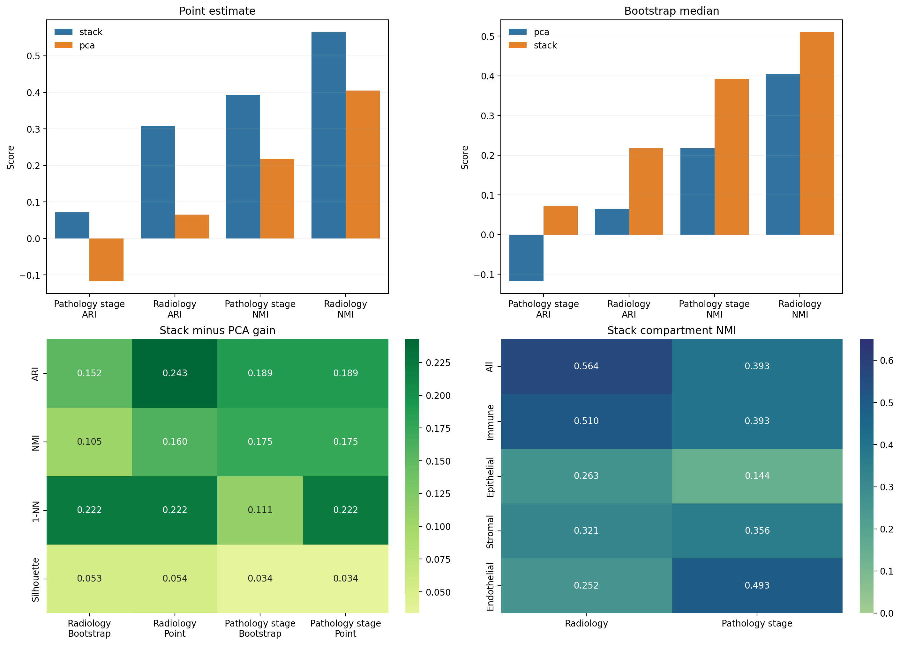

# Stack-Stratification

Stack-Stratification is a public LUAD benchmarking repository for testing whether ARC Institute Stack embeddings recover clinically adjacent cohort structure better than simple transcriptomic baselines.

The current repository is not trying to make a clinical model. It is trying to answer a narrower translational question:

Can a foundation-model representation support trial-relevant cohort slicing in public LUAD data, and does it do so better than a simple PCA baseline?

## Current Status

Current evidence comes from `GSE189357`, a public LUAD single-cell transcriptomics cohort with pathology-stage labels (`AIS/MIA/IAC`) and radiological labels (`SN/pGGN/SSN`).

The repository now supports a more precise view than the original scaffold:

- pathology-stage recovery is weak
- radiology recovery is stronger and more stable
- Stack consistently beats PCA on the same cohort
- epithelial-only restriction does not rescue the signal
- the useful structure looks mixed-cell or microenvironment-aware rather than purely epithelial



## Cohort And Labels

The current benchmark battery uses one public single-cell LUAD cohort:

- cohort: `GSE189357`
- modality: single-cell transcriptomics
- samples in the main completed run: `9`
- cells in the main completed run: `2700`
- pathology labels: `AIS`, `MIA`, `IAC`
- radiology labels: `SN`, `pGGN`, `SSN`

This makes the current repository a compact translational benchmark, not a production-scale clinical study.

## Method Summary

The current workflow is intentionally simple and explicit:

1. build a combined LUAD AnnData object from the public cohort
2. subsample a fixed number of cells per sample
3. generate Stack embeddings for each cell
4. aggregate cell embeddings to sample centroids
5. compare unsupervised structure against known labels with `ARI`, `NMI`, `1-NN`, and silhouette
6. compare Stack against a PCA baseline on the same cells
7. stress-test the result with bootstrap resampling and compartment-restricted views

This design keeps the current question narrow:

Does a foundation-model representation recover clinically adjacent LUAD structure better than a simpler transcriptomic representation?

## Main Results

### Pathology stage benchmark

All-cell sample-centroid agreement with `AIS/MIA/IAC` remains modest:

- Stack point estimate: `ARI 0.071`, `NMI 0.393`, `1-NN 0.333`, `silhouette 0.041`
- PCA point estimate: `ARI -0.118`, `NMI 0.218`, `1-NN 0.111`, `silhouette 0.006`

Bootstrap resampling keeps the same qualitative result:

- Stack bootstrap median: `ARI 0.071`, `NMI 0.393`
- PCA bootstrap median: `ARI -0.118`, `NMI 0.218`

Interpretation: Stack carries more structure than PCA, but this setup does not support a clean pathology-stage enrichment story.

### Radiology benchmark

Radiological phenotype is the strongest public label tested so far:

- Stack point estimate: `ARI 0.308`, `NMI 0.564`, `1-NN 0.222`, `silhouette 0.109`
- PCA point estimate: `ARI 0.065`, `NMI 0.405`, `1-NN 0.000`, `silhouette 0.055`

Bootstrap resampling also favors Stack:

- Stack bootstrap median: `ARI 0.217`, `NMI 0.510`, `1-NN 0.333`
- PCA bootstrap median: `ARI 0.065`, `NMI 0.405`, `1-NN 0.111`

Interpretation: in this cohort, Stack looks more promising for clinically adjacent phenotype recovery than for direct pathology-stage recovery.

### Compartment follow-up

Compartment restriction sharpens the current hypothesis rather than resolving it:

- all-cell and immune-rich views retain the strongest signal
- epithelial-only views are weak for both pathology stage and radiology
- the radiology signal drops from `NMI 0.564` in all cells to `0.263` in epithelial-only cells
- the stage signal drops from `NMI 0.393` in all cells to `0.144` in epithelial-only cells

That matters for trial-facing work. The current value proposition is not "epithelial subtype prediction from a foundation model." It is closer to "microenvironment-aware cohort structure that may support translational enrichment hypotheses."

## Trial-Facing Read

The current repo supports four practical conclusions:

1. Use weak pathology-stage recovery as a cautionary benchmark, not as the lead success criterion.
2. Treat radiology and other clinically adjacent phenotypes as higher-priority public endpoints.
3. Benchmark any proposed enrichment story against simple baselines and bootstrap resampling by default.
4. Do not assume that the best translational signal lives in an epithelial-only slice.

The near-term opportunity is to test whether Stack embeddings help define biologically coherent LUAD cohort slices around immune context, mutation-linked programs, or radiographic phenotype in ways that are more useful than conventional expression reductions.

## Why This Matters For Trials

The practical use case is translational enrichment, not automated diagnosis.

If foundation-model embeddings can reproducibly define LUAD cohort slices that line up with radiographic phenotype, immune context, or mutation-linked biology better than simple baselines, they may help with:

- cohort definition for exploratory translational studies
- biomarker hypothesis generation
- prioritization of follow-up assays
- deciding whether a cohort is better understood through mixed-cell context or malignant-only views

The current repo does not justify clinical claims. It is meant to identify whether a trial-relevant signal exists strongly enough to deserve deeper follow-up.

## Current Artifacts

- Stage benchmark: [results/luad_stage_benchmark_300](results/luad_stage_benchmark_300)
- Stage compartment follow-up: [results/luad_stage_compartments](results/luad_stage_compartments)
- Stage Stack versus PCA comparison: [results/luad_stage_representation_comparison](results/luad_stage_representation_comparison)
- Stage bootstrap: [results/luad_stage_bootstrap](results/luad_stage_bootstrap)
- Radiology benchmark: [results/luad_radiology_benchmark](results/luad_radiology_benchmark)
- Radiology bootstrap: [results/luad_radiology_bootstrap](results/luad_radiology_bootstrap)
- Radiology compartments: [results/luad_radiology_compartments](results/luad_radiology_compartments)
- Program summary: [results/luad_benchmark_summary](results/luad_benchmark_summary)

## Repository Layout

- `src/stack_stratification/`: package scaffold and CLI entrypoint
- `scripts/`: benchmark, comparison, bootstrap, and summary scripts
- `results/`: committed analysis outputs and figures used in the README
- `runs/`: local working directories for generated intermediate artifacts
- `docs/`: methodology, trial framing, and roadmap notes
- `models/`: local Stack checkpoint assets

## Key Scripts

- `scripts/run_luad_stage_benchmark.py`: build the main stage benchmark run
- `scripts/analyze_luad_stage_compartments.py`: test coarse compartment restrictions for stage
- `scripts/compare_luad_stage_representations.py`: compare Stack and PCA on stage
- `scripts/bootstrap_luad_stage_signal.py`: bootstrap the stage benchmark
- `scripts/benchmark_luad_radiology.py`: run the radiology benchmark
- `scripts/bootstrap_luad_radiology.py`: bootstrap the radiology benchmark
- `scripts/analyze_luad_radiology_compartments.py`: test coarse compartment restrictions for radiology
- `scripts/summarize_luad_benchmarks.py`: generate the repo-wide scorecard and summary figures

## Research Direction

The next month should focus on whether this radiology-plus-microenvironment signal generalizes and whether it extends to labels that are closer to actual trial design decisions.

Priority next benchmarks:

1. mutation-linked LUAD cohorts such as `EGFR`- or `KRAS`-associated biology
2. immune-context labels that can support enrichment-style subgrouping
3. a more principled malignant-cell-focused restriction instead of coarse marker bins
4. donor-balanced and cohort-transfer evaluation rather than single-cohort point estimates

The current roadmap is documented in:

- [docs/project_plan.md](docs/project_plan.md)
- [docs/trial_relevance.md](docs/trial_relevance.md)
- [docs/luad_stage_benchmark.md](docs/luad_stage_benchmark.md)
- [docs/research_roadmap.md](docs/research_roadmap.md)

## Limitations

The current repository has clear limits and the README should state them directly:

- the active benchmark is still a single public cohort
- sample count is small
- the compartment split is coarse and marker-based
- current labels are clinically adjacent, not treatment-response endpoints
- mixed-cell signal can reflect composition as well as deeper biology

Those constraints are exactly why the next phase should emphasize second-cohort replication, stronger cell-state restriction, and enrichment-style evaluation rather than adding more visualization alone.

## Run The Analyses

Use Python `3.11+`.

```bash
python3.11 -m venv .venv311
source .venv311/bin/activate
pip install -e .
```

Stage benchmark:

```bash
.venv311/bin/python scripts/run_luad_stage_benchmark.py \
  --max-cells-per-sample 300 \
  --batch-size 8 \
  --workdir runs/luad_stage_benchmark_300
```

Stage follow-ups:

```bash
.venv311/bin/python scripts/analyze_luad_stage_compartments.py \
  --adata runs/luad_stage_benchmark_300/gse189357_stage_subset.h5ad \
  --embeddings runs/luad_stage_benchmark_300/gse189357_stage_subset_stack_embeddings.h5ad \
  --output-dir results/luad_stage_compartments

.venv311/bin/python scripts/compare_luad_stage_representations.py \
  --adata runs/luad_stage_benchmark_300/gse189357_stage_subset.h5ad \
  --stack-embeddings runs/luad_stage_benchmark_300/gse189357_stage_subset_stack_embeddings.h5ad \
  --compartments results/luad_stage_compartments/cell_compartments.csv \
  --output-dir results/luad_stage_representation_comparison

.venv311/bin/python scripts/bootstrap_luad_stage_signal.py \
  --adata runs/luad_stage_benchmark_300/gse189357_stage_subset.h5ad \
  --stack-embeddings runs/luad_stage_benchmark_300/gse189357_stage_subset_stack_embeddings.h5ad \
  --compartments results/luad_stage_compartments/cell_compartments.csv \
  --output-dir results/luad_stage_bootstrap
```

Radiology follow-ups:

```bash
.venv311/bin/python scripts/benchmark_luad_radiology.py \
  --adata runs/luad_stage_benchmark_300/gse189357_stage_subset.h5ad \
  --stack-embeddings runs/luad_stage_benchmark_300/gse189357_stage_subset_stack_embeddings.h5ad \
  --output-dir results/luad_radiology_benchmark

.venv311/bin/python scripts/bootstrap_luad_radiology.py \
  --adata runs/luad_stage_benchmark_300/gse189357_stage_subset.h5ad \
  --stack-embeddings runs/luad_stage_benchmark_300/gse189357_stage_subset_stack_embeddings.h5ad \
  --output-dir results/luad_radiology_bootstrap

.venv311/bin/python scripts/analyze_luad_radiology_compartments.py \
  --adata runs/luad_stage_benchmark_300/gse189357_stage_subset.h5ad \
  --stack-embeddings runs/luad_stage_benchmark_300/gse189357_stage_subset_stack_embeddings.h5ad \
  --compartments results/luad_stage_compartments/cell_compartments.csv \
  --output-dir results/luad_radiology_compartments
```

Program summary:

```bash
.venv311/bin/python scripts/summarize_luad_benchmarks.py
```
