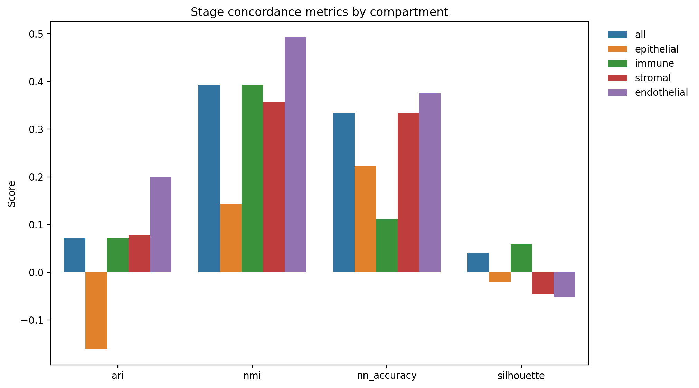
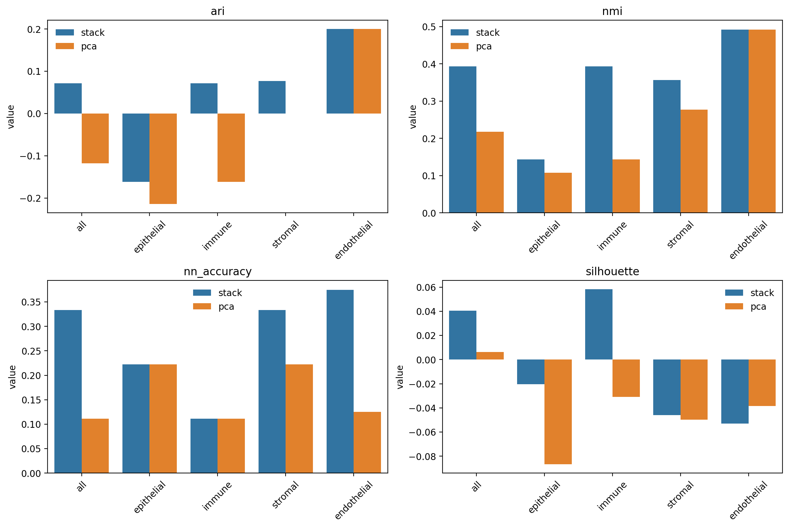
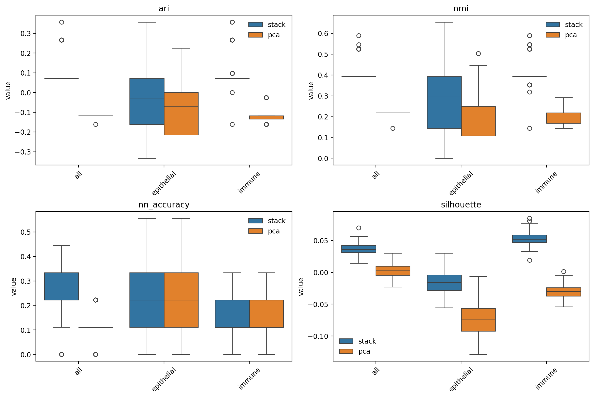
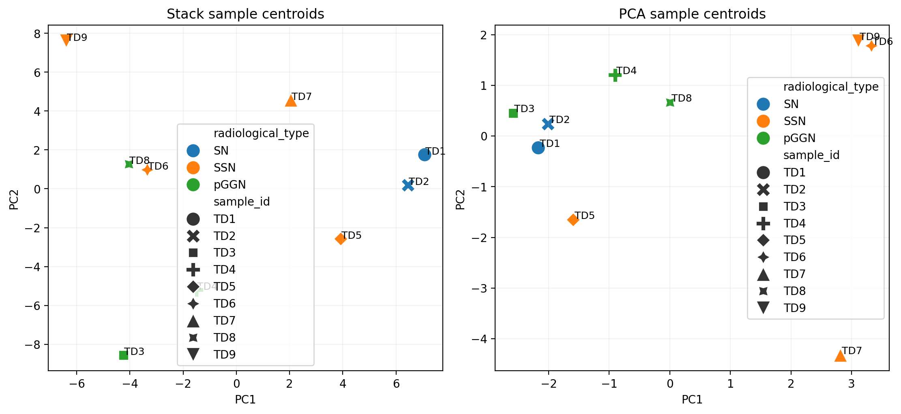
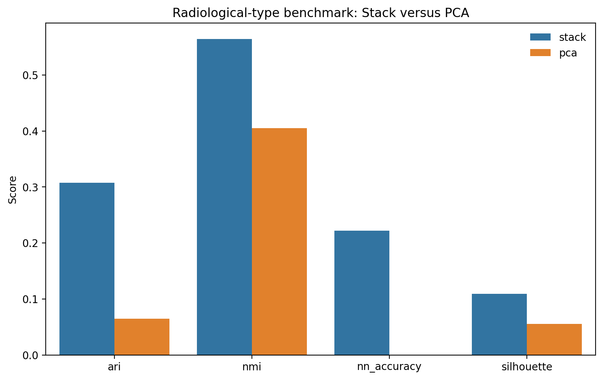
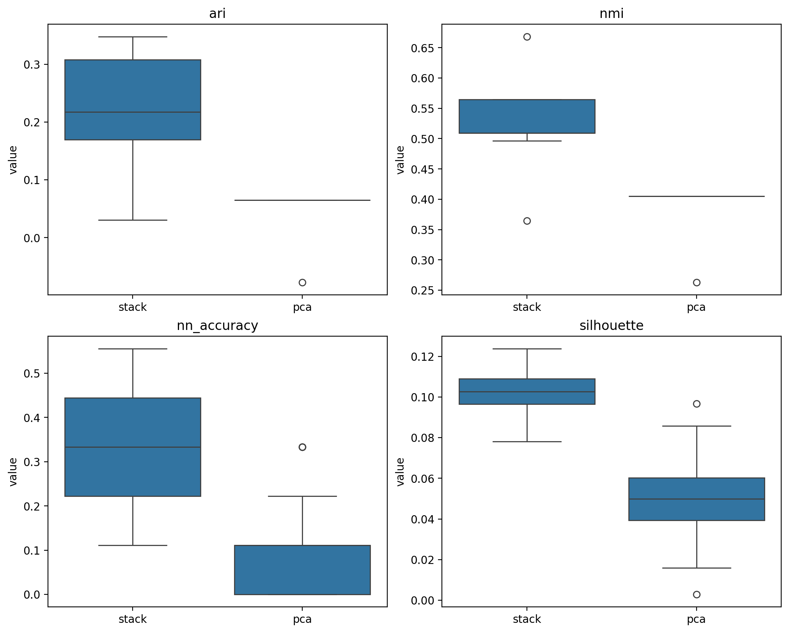
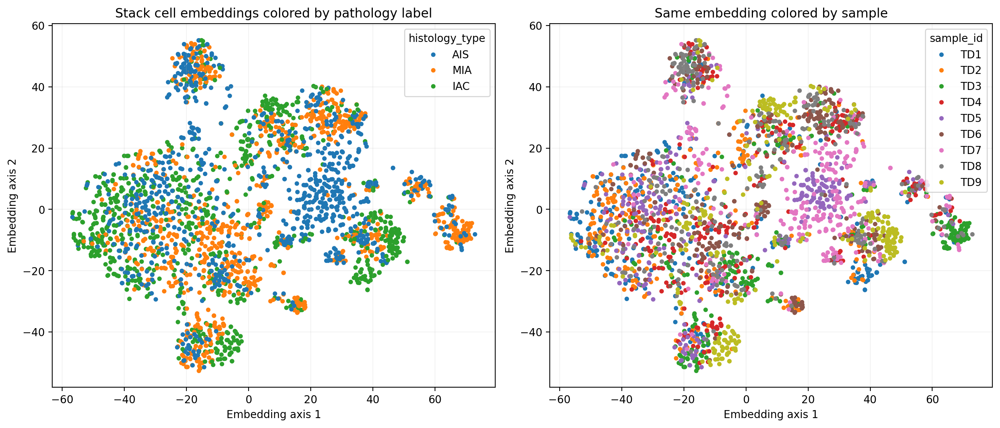
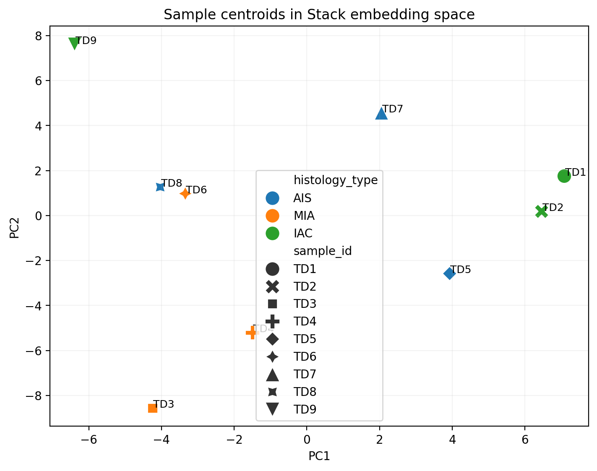
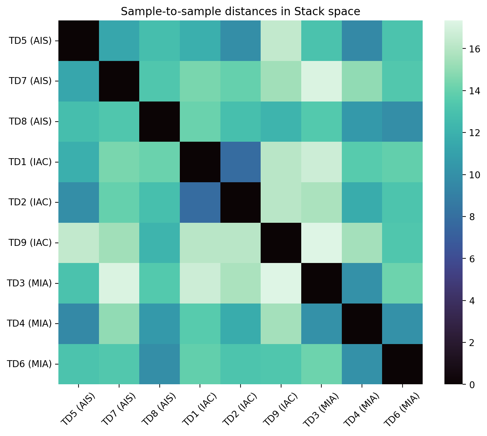

# Stack-Stratification

Stack-Stratification is a compact LUAD benchmarking repository built around ARC Institute Stack embeddings.

The current repository focus is a concrete question rather than a generic pipeline:

Can unsupervised structure in Stack embeddings recover an already established LUAD pathology label in a small public single-cell cohort?

## Current Experiment

- Cohort: `GSE189357`
- Modality: single-cell transcriptomics
- Benchmark label: `AIS` vs `MIA` vs `IAC`
- Representation layer: ARC Institute `Stack-Large`
- Analysis unit: cell embeddings aggregated to sample centroids

## Current Result

The first completed benchmark used `300` cells per sample across `9` LUAD samples (`2700` total cells, balanced `3/3/3` across `AIS/MIA/IAC`).

Observed agreement between unsupervised sample clustering and pathology stage was weak:

- `ARI`: `0.071`
- `NMI`: `0.393`
- `1-NN histology accuracy`: `0.333`
- `Sample-centroid silhouette by histology`: `0.041`

That is a useful result, not a failure. On this first completed pass, Stack space does not cleanly separate LUAD pathology stage at the sample-centroid level. The current evidence supports a cautious conclusion:

Stack embeddings may contain some stage-related structure, but not enough in this setup to claim clean recovery of `AIS/MIA/IAC`.

## Deeper Cut

A marker-based compartment follow-up on the same `2700`-cell run suggests that the modest all-cell signal is not strengthened by restricting to epithelial-like cells.

- `Epithelial-only`: `ARI -0.161`, `NMI 0.144`, `1-NN 0.222`
- `Immune-only`: `ARI 0.071`, `NMI 0.393`, `1-NN 0.111`
- `Endothelial-only`: `ARI 0.200`, `NMI 0.493`, `1-NN 0.375`, but only `8` samples and negative silhouette

The practical read is that this small benchmark is not showing a clean epithelial stage trajectory in Stack space. If there is useful stage signal here, it is at least partly entangled with non-epithelial structure and sample composition.



## Baseline Check

Stack does appear to add signal over a simple PCA baseline on the same data.

- `All cells`: Stack `NMI 0.393` vs PCA `0.218`; Stack `ARI 0.071` vs PCA `-0.118`
- `All cells`: Stack `1-NN 0.333` vs PCA `0.111`
- `Immune-only`: Stack `NMI 0.393` vs PCA `0.144`
- `Epithelial-only`: both representations remain weak

So the current repo story is more specific now:

Stack is better than a basic PCA baseline here, but the observed signal is still not strong enough to claim clean pathology-stage recovery, especially in epithelial-like cells.



## Stability Check

Within-sample bootstrap resampling supports the same basic story.

- `All-cell` median `NMI`: Stack `0.393` vs PCA `0.218`
- `All-cell` median `ARI`: Stack `0.071` vs PCA `-0.118`
- `Immune-only` median `NMI`: Stack `0.393` vs PCA `0.169`
- `Epithelial-only` remains weak for both methods, even though Stack is slightly better on median `NMI`

That makes the current claim more robust:

Stack is not producing a clean LUAD pathology-stage separator here, but it is consistently stronger than a simple PCA baseline under cell-level resampling.



## Radiology Benchmark

The same cohort also includes a public radiological label (`SN`, `pGGN`, `SSN`), which is closer to a clinically used phenotype than the pathology-stage grouping alone.

On that benchmark, Stack looks stronger:

- Stack: `ARI 0.308`, `NMI 0.564`, `1-NN 0.222`, `silhouette 0.109`
- PCA: `ARI 0.065`, `NMI 0.405`, `1-NN 0.000`, `silhouette 0.055`

That makes the trial-facing story sharper:

Stack may be more useful for clinically adjacent phenotype recovery and cohort slicing than for direct pathology-stage recovery in this small LUAD setting.




Bootstrap stability keeps that result intact:

- Stack median radiology `NMI 0.510` vs PCA `0.405`
- Stack median radiology `ARI 0.217` vs PCA `0.065`
- Stack median radiology `1-NN 0.333` vs PCA `0.111`



## Trial Relevance

The point of this repository is not subtype naming for its own sake. The point is to test whether foundation-model representations can support trial-adjacent cohort enrichment.

The current evidence suggests:

- Stack is not ready, in this setup, to support a clean `AIS/MIA/IAC` enrichment story
- Stack does carry more structured signal than a simple PCA baseline
- The signal appears more entangled with microenvironmental composition than with a clean epithelial stage program

That pushes the trial-facing interpretation in a specific direction:

Near-term value is more likely to come from using foundation-model embeddings to define biologically coherent cohort slices for translational hypothesis generation, especially around immune context, than from claiming direct clinical-stage prediction.

So the next iterations should prioritize labels and endpoints that are closer to actual trial design decisions:

1. immune-inflamed versus immune-suppressed states
2. mutation-defined cohorts such as `EGFR`- or `KRAS`-linked biology
3. radiographic or pathology features that influence enrichment strategy
4. response- or resistance-adjacent public labels when available

## Figures

### Cell embedding view



### Sample centroids in Stack space



### Sample-to-sample distances



## Interpretation

This repository is intentionally framed as a translational benchmark, not a clinical model.

The current result suggests a few immediate next steps:

1. Move from pathology-stage benchmarking toward trial-facing enrichment labels.
2. Restrict to more relevant compartments instead of mixing all tumor microenvironment cells.
3. Test whether Stack improves cohort slicing beyond simple baselines for immune-, mutation-, or radiology-linked strata.
4. Add public labels that are closer to treatment selection, resistance, or response biology.

## Run The Benchmark

Use Python `3.11+` for the experiment runtime.

```bash
python3.11 -m venv .venv311
source .venv311/bin/activate
pip install -e .
```

Quick pass:

```bash
.venv311/bin/python scripts/run_luad_stage_benchmark.py \
  --max-cells-per-sample 80 \
  --batch-size 4 \
  --workdir runs/luad_stage_benchmark_quick
```

Completed larger pass:

```bash
.venv311/bin/python scripts/run_luad_stage_benchmark.py \
  --max-cells-per-sample 300 \
  --batch-size 8 \
  --workdir runs/luad_stage_benchmark_300
```

Detached larger pass with durable logs:

```bash
zsh scripts/launch_stage_benchmark.sh \
  --workdir runs/luad_stage_benchmark_overnight \
  --max-cells-per-sample 300 \
  --batch-size 8

zsh scripts/status_stage_benchmark.sh \
  --workdir runs/luad_stage_benchmark_overnight
```

Compartment follow-up on a completed run:

```bash
.venv311/bin/python scripts/analyze_luad_stage_compartments.py \
  --adata runs/luad_stage_benchmark_300/gse189357_stage_subset.h5ad \
  --embeddings runs/luad_stage_benchmark_300/gse189357_stage_subset_stack_embeddings.h5ad \
  --output-dir results/luad_stage_compartments
```

Stack versus PCA baseline comparison:

```bash
.venv311/bin/python scripts/compare_luad_stage_representations.py \
  --adata runs/luad_stage_benchmark_300/gse189357_stage_subset.h5ad \
  --stack-embeddings runs/luad_stage_benchmark_300/gse189357_stage_subset_stack_embeddings.h5ad \
  --compartments results/luad_stage_compartments/cell_compartments.csv \
  --output-dir results/luad_stage_representation_comparison
```

Bootstrap the representation comparison:

```bash
.venv311/bin/python scripts/bootstrap_luad_stage_signal.py \
  --adata runs/luad_stage_benchmark_300/gse189357_stage_subset.h5ad \
  --stack-embeddings runs/luad_stage_benchmark_300/gse189357_stage_subset_stack_embeddings.h5ad \
  --compartments results/luad_stage_compartments/cell_compartments.csv \
  --output-dir results/luad_stage_bootstrap
```

Radiological-type benchmark:

```bash
.venv311/bin/python scripts/benchmark_luad_radiology.py \
  --adata runs/luad_stage_benchmark_300/gse189357_stage_subset.h5ad \
  --stack-embeddings runs/luad_stage_benchmark_300/gse189357_stage_subset_stack_embeddings.h5ad \
  --output-dir results/luad_radiology_benchmark
```

Bootstrap the radiological-type benchmark:

```bash
.venv311/bin/python scripts/bootstrap_luad_radiology.py \
  --adata runs/luad_stage_benchmark_300/gse189357_stage_subset.h5ad \
  --stack-embeddings runs/luad_stage_benchmark_300/gse189357_stage_subset_stack_embeddings.h5ad \
  --output-dir results/luad_radiology_bootstrap
```

## Repository Layout

```text
docs/                         Project notes and methodology
results/                      Repo-visible benchmark figures and metrics
scripts/                      Experiment entrypoints and run wrappers
src/stack_stratification/     Package scaffold
```

## Current Limits

- The first benchmark uses a small subset for speed and debuggability.
- A smaller `720`-cell quick pass is also retained under `results/luad_stage_benchmark_quick/`.
- A compartment follow-up is available under `results/luad_stage_compartments/`.
- A Stack-versus-PCA comparison is available under `results/luad_stage_representation_comparison/`.
- A bootstrap stability analysis is available under `results/luad_stage_bootstrap/`.
- A radiological-type benchmark is available under `results/luad_radiology_benchmark/`.
- A radiological-type bootstrap analysis is available under `results/luad_radiology_bootstrap/`.
- The current analysis uses all cells rather than cell-type-restricted compartments.
- Pathology-stage recovery is being evaluated descriptively and should not be interpreted as a clinical claim.
